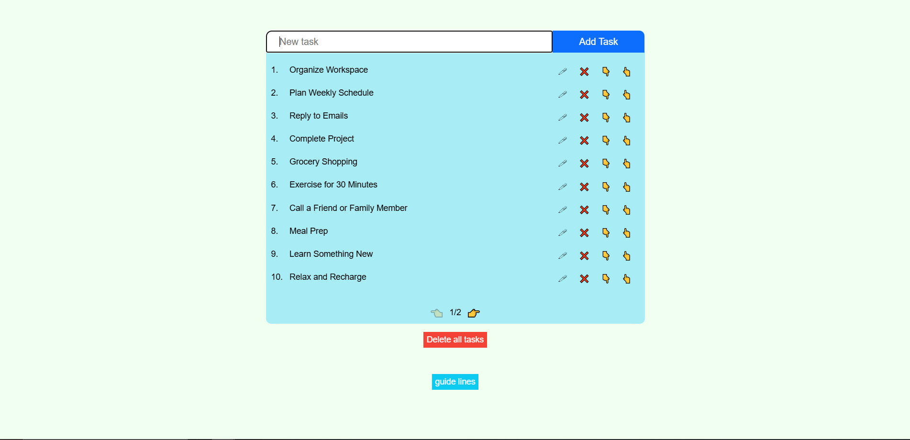

# Task Manager Application

 Welcome to My Task Manager!  
This is a A simple and interactive Task Manager built with React.
It allows users to Add, Edit, Delete, Reorder and Navigate tasks using pagination.

---

## Screen Shot

---

## Features

Task Manager provides the following features:  
1. **Add Tasks** – Enter a task name and click "Add Task" or press `Enter` to add it to the list.  
2. **Edit Tasks** – Click on the edit button of a task to enable editing mode and modify its name directly.  
3. **Delete Tasks** – Remove tasks individually or delete all tasks at once with a confirmation prompt.  
4. **Reorder Tasks** – Move tasks up or down in the list to customize their order.  
5. **Pagination** – Navigate between pages, with a maximum of 10 tasks displayed per page.  
6. **Guidelines** – View helpful tips and instructions by toggling the guidelines section.  

---

## Components Overview

This project is modularized into several reusable and functional components:

1. **TaskManager**
   - The central component that manages the application's state and coordinates all other components.
   - Handles task creation, editing, deletion, pagination, and ordering logic.

2. **AddTaskForm**
   - A form allowing users to add new tasks.
   - Includes validation to ensure task names are non-empty and within a character limit.
   - Handles "Enter" key submissions for a smooth user experience.

3. **TaskItem**
   - Represents an individual task within the task list.
   - Provides UI for task details (name, edit, delete, move up/down).
   - Includes editing and deletion buttons that trigger respective actions in the `TaskList`.

4. **TaskList**
   - Displays a paginated list of tasks.
   - Provides options for editing, deleting, and rearranging tasks.
   - Passes interactions back to `TaskManager` for state updates.

5. **Pagination**
   - Controls navigation between task pages.

6. **DeleteAllTasks**
   - Provides a modal for confirming the deletion of all tasks.
   - Includes cancel and confirm actions to ensure accidental deletions are avoided.

7. **GuideLines**
   - A static component that displays usage instructions or helpful tips for users.
   - Serves as an introductory guide for understanding the interface.

---

## Libraries and Technologies

This project is built with the following technologies:

* JavaScript (React)
* TypeScript
* HTML
* CSS
* Node
* Vite

---